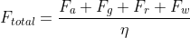
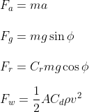
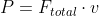
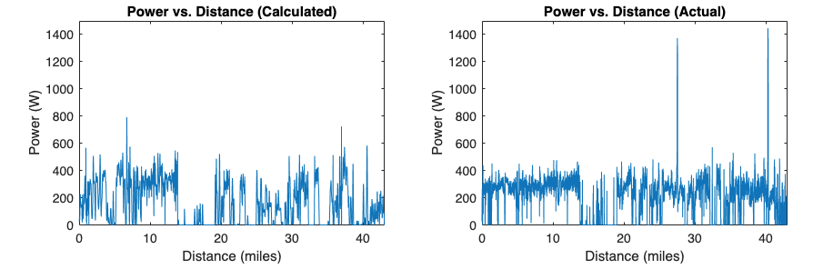
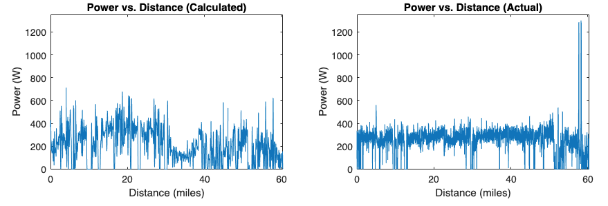
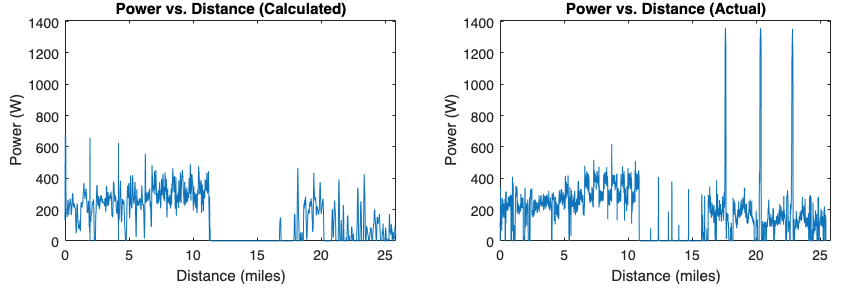

# Power_Meter
A Matlab program that calculates power output of cyclist from a gpx file

# Motivation
Power meters are crucial for cycling training. They are used to construst regimented schedules and workouts to optimize athlete improvement. However, being very expensive and difficult to install, many seek alternatives. From only a gpx file, this program attempts to replicate a power meter as accuractely as possible by calculating the instantaneous power output over the course of a ride. 

# Methods
The total force exerted by a rider in motion is the sum of the force of gravity _Fg_, the force needed to accelerate _Fa_, the force of rolling resistance _Fr_, and the force of air resistance _Fw_, divided by the drive-train efficiency η.

 

For each individual force, we can write the follwing equations:

 

Where Φ is the angle of incline, _Crr_ is the rolling coefficient, _Cd_ is the drag coefficient, and ρ is air density. 

Thus we can write the power output of the rider as:

 

# Results
To test the accuracy of this model, the calculated output power was compared to power meter data in three different rides.
## Test 1

 

Calculated Average Power = 185 W
Actual Average Power = 212 W
Difference: 14%

## Test 2

 

Calculated Average Power = 221 W
Actual Average Power = 248 W
Difference: 11%

## Test 3

 

Calculated Average Power = 180 W
Actual Average Power = 201 W
Difference: 11%

