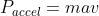
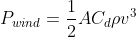
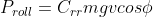

# Power_Meter
A Matlab program that calculates power output of cyclist from a gpx file

# Motivation
Power meters are crucial for cycling training. They are used to construst regimented schedules and workouts to optimize athletes' benefits. However, being very expensive and difficult to install, many seek alternatives. From only a gpx file, this program attempts to replicate a power meter as accuractely as possible by calculating the instantaneous power output over the course of a ride. 

# Methods
Velocity(v) and accerlation(a) were derived from longitude and latitude coordinates. Wind magnetitude and direction were found using Meteostat API. Mass(m) of both rider and bike was taken as input.

We know that the power output from a rider must equal sum of the power of acceleration, the power of wind resistance, the power of rolling resistance, and the power of gravity. 

The power of accleration follows from Newton's Second Law:

 

The power of wind resistance is given by:

 

Where A is the area exposed to wind, Cd is the drag coefficient and !
[]img/rho.gif 
is the density of air. 

The power of rolling resistance is given by:

 

Where Crr is the rolling coefficient and ![]img/phi.gif is the angle of incline.
The power of gravity is 

