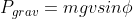
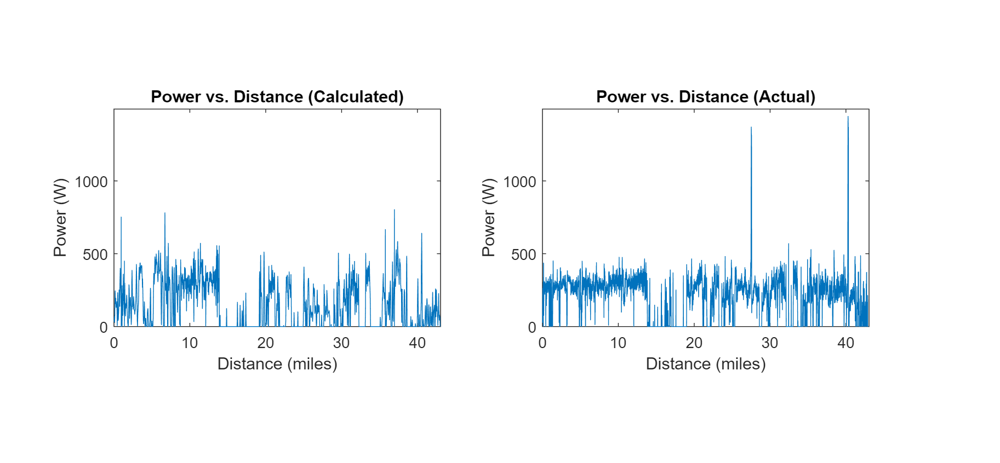
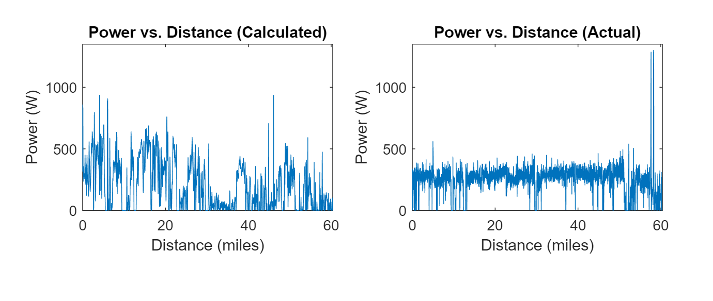
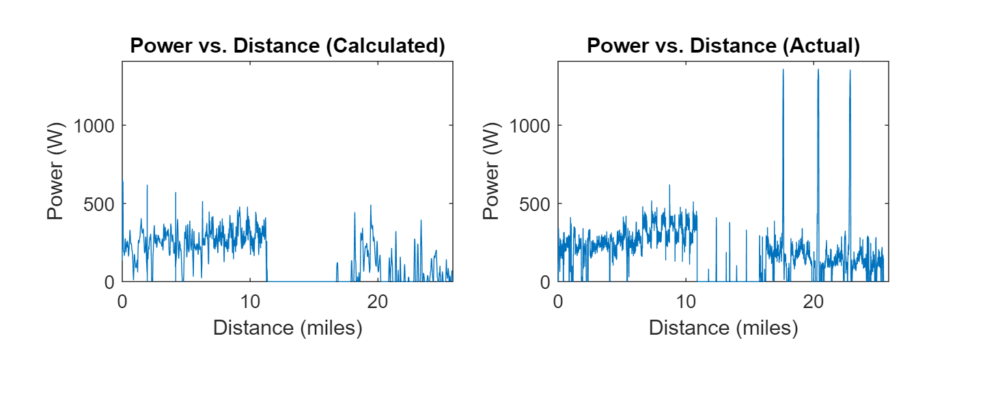

# Power_Meter
A Matlab program that calculates power output of cyclist from a gpx file

# Motivation
Power meters are crucial for cycling training. They are used to construst regimented schedules and workouts to optimize athletes' benefits. However, being very expensive and difficult to install, many seek alternatives. From only a gpx file, this program attempts to replicate a power meter as accuractely as possible by calculating the instantaneous power output over the course of a ride. 

# Methods
Velocity(v) and acceleration(a) were derived from longitude and latitude coordinates. Wind magnitude and direction were found using Meteostat API. Mass(m) of both rider and bike was taken as input.

We know that the power output from a rider must equal sum the of the power of acceleration, the power of gravity, the power of wind resistance, and the power of rolling resistance. When Φ is the angle of incline, A is the area exposed to the wind, Crr is the rolling coefficient, Cd is the drag coefficient, and ρ is the density of air, we can write the following equations: 

 

 

 

 

# Results
To test the accuracy of this model, the calculated output power was compared to power meter data in three different rides.
## Test 1

 

Calculated Average Power = 
Actual Average Power = 

## Test 2

 

Calculated Average Power = 
Actual Average Power = 

## Test 3

 

Calculated Average Power = 
Actual Average Power = 
